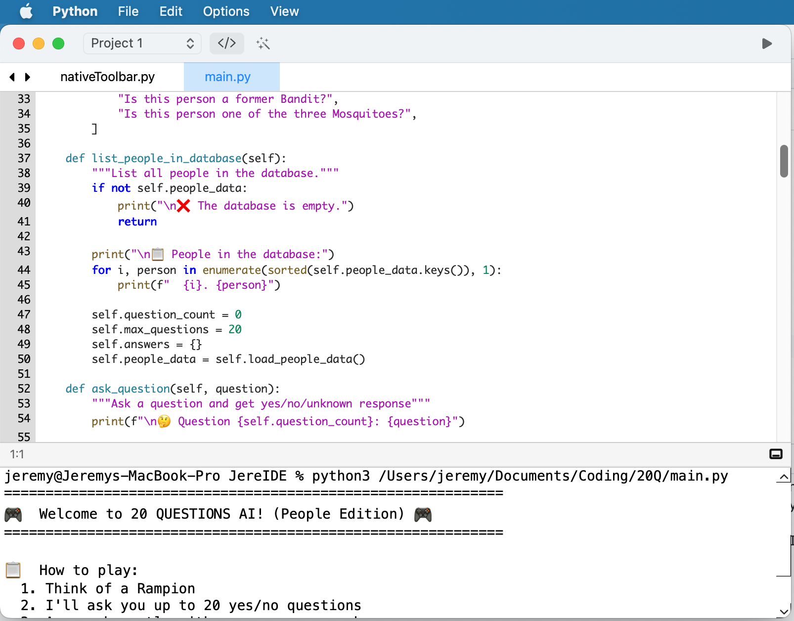

<div align="center">
    

# JereIDE
  
**the fast simple code editor**


*Python code editor, in progress and in beta*  
  
<kbd>
  
</kbd>


</div>

---

A Pyside6 + PyObjC implementation of [JereIDE_wx](https://github.com/Jeremy-Qian/JereIDE_wx).  Still in beta.  

This project was initially a vibe coding project, but I edit the code manually more and more.

## Installation

### Prerequisites

- macOS 12.7+
- Python 3.11+

### Dependencies

| Package | Purpose |
|---------|---------|
| `PySide6` | Qt6 bindings — core UI framework |
| `pyobjc` | Bridge to native macOS APIs (toolbar, SF Symbols) |
| `pyte` | Terminal emulator for the integrated terminal |

### Setup

```bash
# Clone the repository
git clone https://github.com/Jeremy-Qian/JereIDE.git
cd JereIDE

# Install dependencies
pip install -r requirements.txt

# Run the application
python3 src/JereIDE.py
```

> **Note:** This application is optimized for macOS only.

## Development


## Rules for AI Agents
This app is optimized for MAC only. It is built by mostly AI.

If you are an agent:
Do not write code for other platforms except for macOS. When writing code, use camelCase and use specific variable names.

## FAQ

<details> 
    <summary>
        How is this different from other editors?
    </summary> 

    * JereIDE has a unique "Command View" that is in progress. 
    * JereIDE also has an integrated terminal that allows you to run shell commands right in the IDE. 
    * JereIDE uses PyObjC to interact with the macOS API, creating a native Xcode-like look that looks great.
</details>


## Plans for the future
- [x] Docstring highlighting
- [ ] Save all, recent files
- [ ] Command View  
- [ ] Find/Replace: regex, whole words, wrap options

For a full list of what's coming next, see the [JereIDE Roadmap](https://github.com/users/Jeremy-Qian/projects/4/views/1).

## License
This project is licensed under the MIT License.
