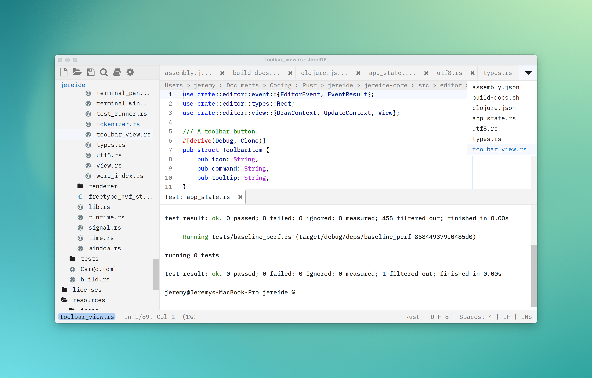

# JereIDE

A fast, simple code editor built in Rust.



<div align="center">

_For all the screenshots, see [demo.md](.github/images/demo.md)._

</div>

JereIDE began as a fork of [lite-anvil](https://github.com/danpozmanter/lite-anvil), and many useful features have been added after that.

## Features

- **Built-in LSP** with diagnostics, completion, hover, go-to-definition, references, inlay hints
- **Embedded terminal** with ANSI colors, scrollback, and multi-terminal support
- **Find & Replace** with live search, match counter, regex/whole-word/case toggles, and find-in-selection
- **Bookmarks** -- toggle with Ctrl+F4, navigate with F4 / Shift+F4, accent marker in gutter
- **Code folding** with indent-based fold detection
- **Project-wide search** (Ctrl+Shift+F) with grep-based results
- **Git integration** -- gutter markers, status view, blame annotations, file log, push/pull/commit/stash
- **Multi-cursor editing** -- Ctrl+Shift+Up/Down to add cursors, Ctrl+D to select next occurrence
- **Minimap** with syntax-colored blocks, click to scroll
- **Language-aware line comments** -- Ctrl+/ picks the correct marker for 51 languages
- **51 built-in syntax grammars** including Rust, Go, Python, TypeScript, C, C++, Java, and more
- **Session restore** -- open files, active tab, font scale persist across restarts
- **Native file watching** via inotify for external-change detection
- **JSON-backed color themes** (`data/assets/themes/*.json`) with runtime cycling (Ctrl+T)
- **Keyboard-navigated file/folder open** with filesystem autocomplete and `:N` line support
- **Format on paste** -- converts pasted indent whitespace to match document style
- **Color-coded sidebar icons** by file extension (90+ extensions)
- **Check for Updates** from the command palette
- **Graceful font fallback** -- falls back to built-in fonts with a warning if custom fonts fail

## Shortcuts

| Key                     | Action                     |
| ----------------------- | -------------------------- |
| `Ctrl+P`                | Open file                  |
| `Ctrl+Shift+P`          | Command palette            |
| `Ctrl+O`                | Open project folder        |
| `Ctrl+T`                | Cycle color theme          |
| `Ctrl+Shift+R`          | Open recent file or folder |
| `Ctrl+Shift+F`          | Find in files              |
| `Alt+Shift+F`           | Replace in files           |
| `Ctrl+F`                | Find in file               |
| `Alt+F`                 | Replace in file            |
| `F3` / `Shift+F3`       | Next / previous match      |
| `Ctrl+/`                | Toggle line comment        |
| `Ctrl+Up` / `Ctrl+Down` | Move line up / down        |
| `Ctrl+F4`               | Toggle bookmark            |
| `F4` / `Shift+F4`       | Next / previous bookmark   |
| `Ctrl+Shift+[` / `]`    | Fold / unfold code block   |
| `Ctrl+=` / `Ctrl+-`     | Font zoom in / out         |
| `Ctrl+M`                | Toggle minimap             |
| `Alt+Z`                 | Toggle line wrapping       |
| `Ctrl+B`                | Toggle sidebar             |
| `Ctrl+`` ` / `F5`       | Toggle terminal            |
| `F12`                   | Go to definition (LSP)     |
| `Ctrl+K`                | Hover info (LSP)           |
| `Ctrl+W`                | Close tab                  |
| `Ctrl+Tab`              | Next tab                   |

## Building

### Quick start

```bash
# Ubuntu / Debian
apt install libsdl3-dev libfreetype6-dev libpcre2-dev

# Build
cargo build --release

# Run
./target/release/jereide [path]
```

Rust 1.85+ required. See [BUILDING.md](BUILDING.md) for full instructions
including macOS, Windows, and packaging.

## Fonts

- [Lilex](https://github.com/mishamyrt/Lilex) -- editor font
- [Seti](https://github.com/jesseweed/seti-ui) -- file type icons

## License

MIT -- see [LICENSE](LICENSE).
